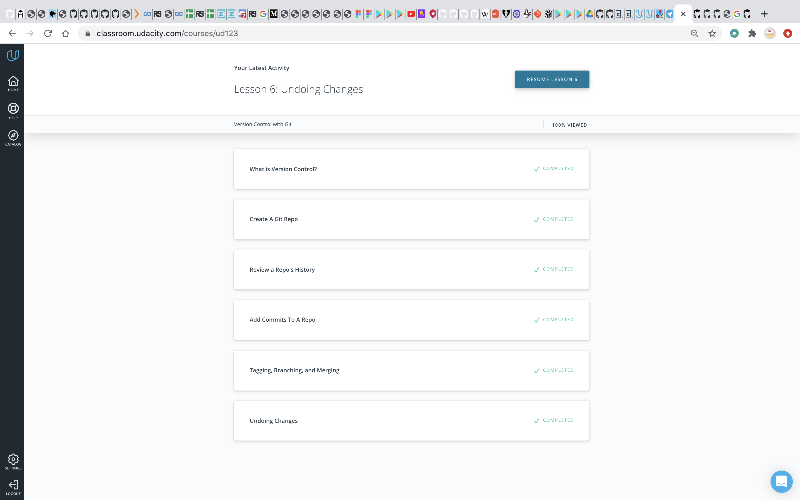
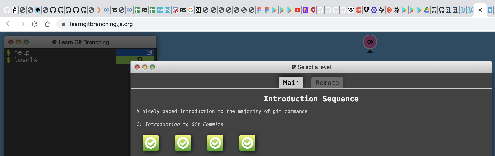
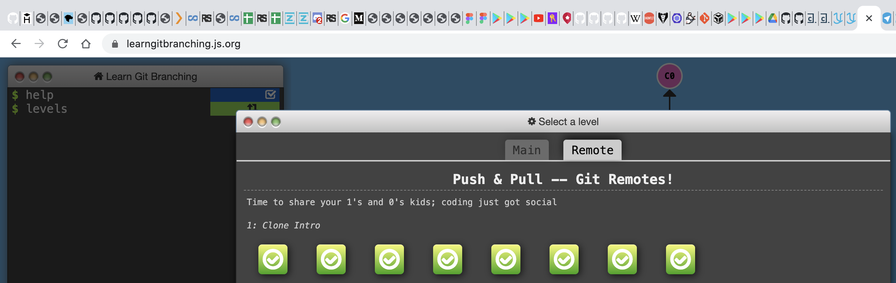
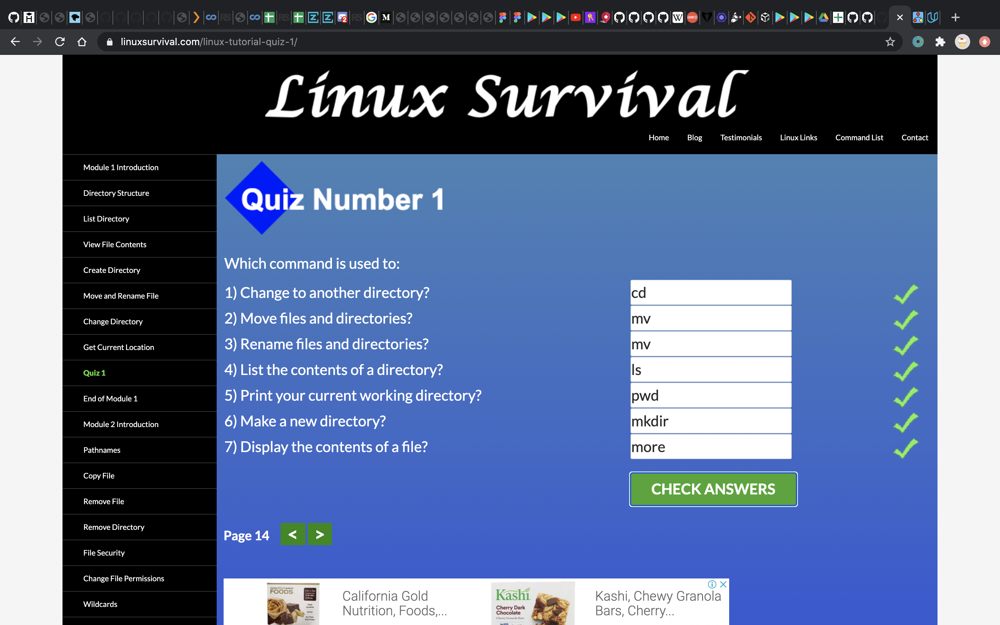
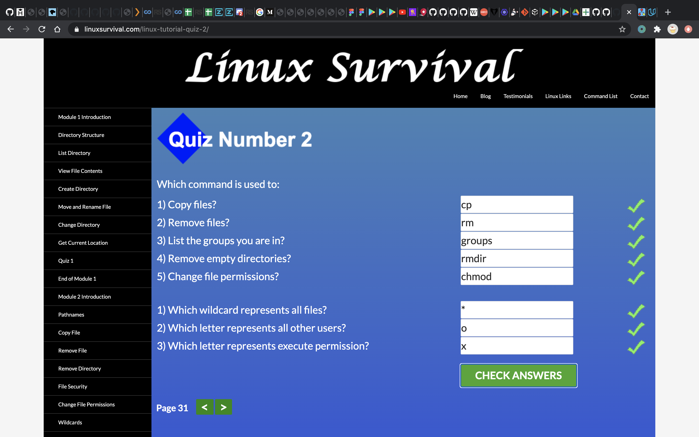
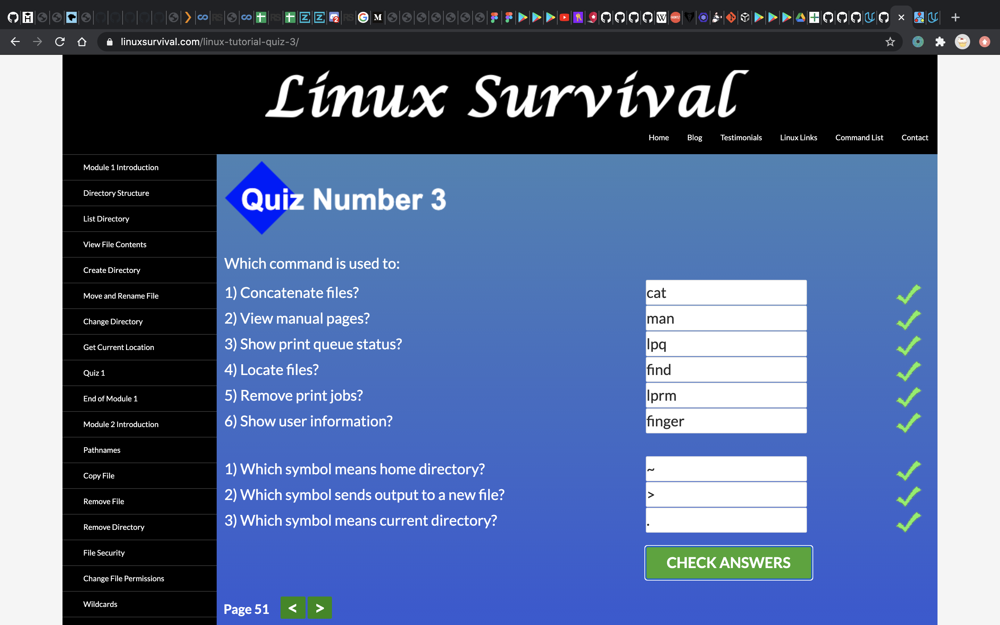
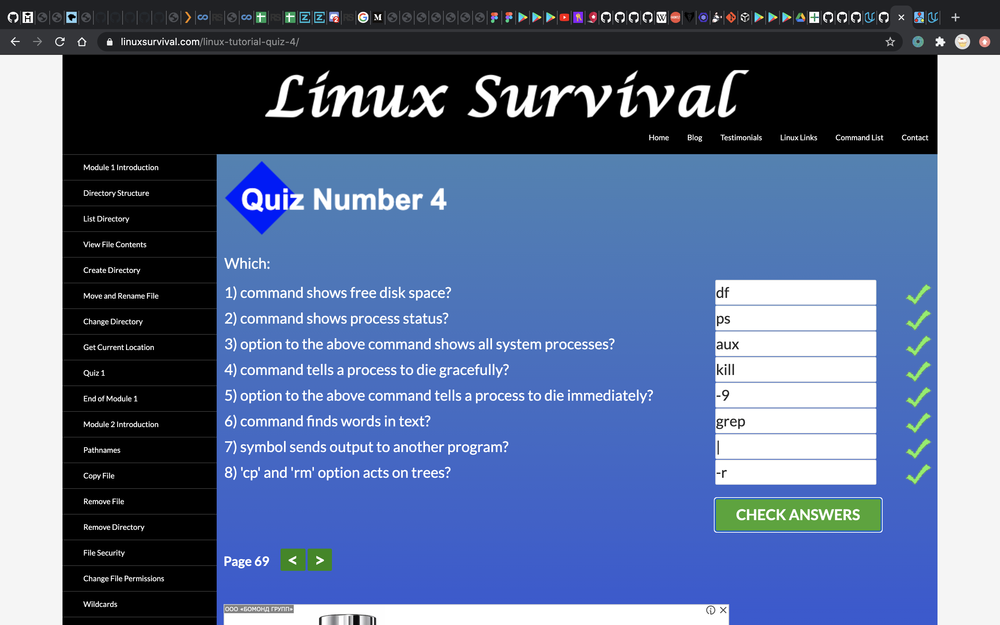
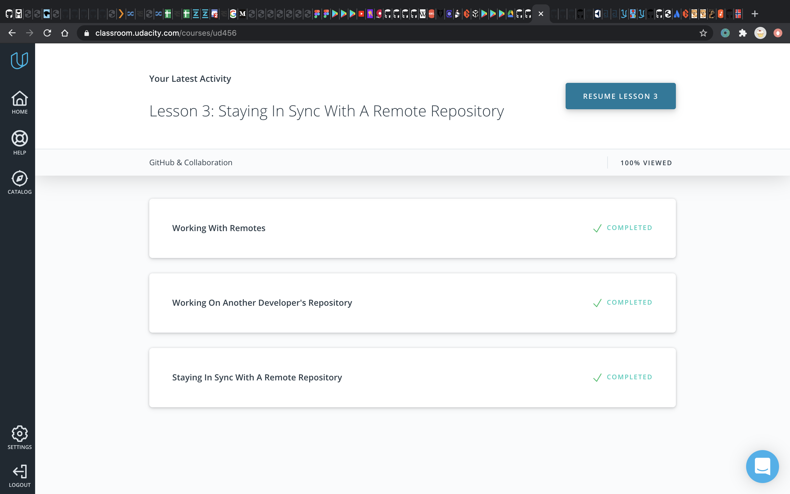
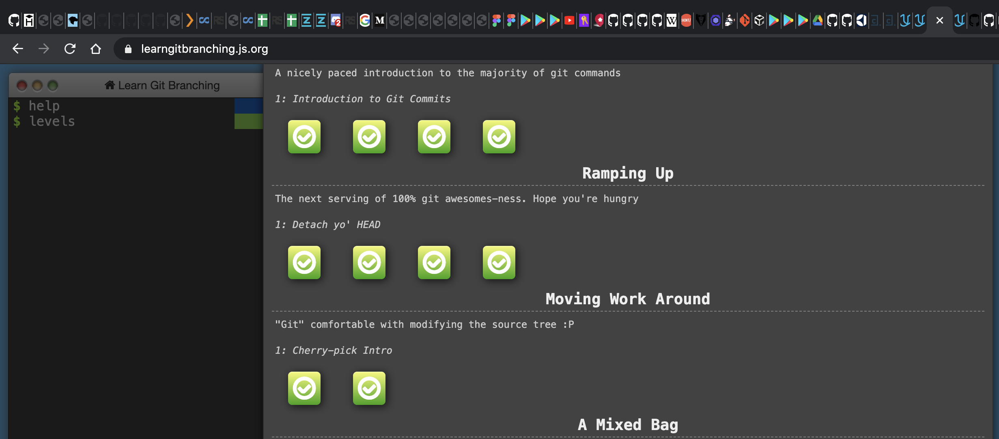
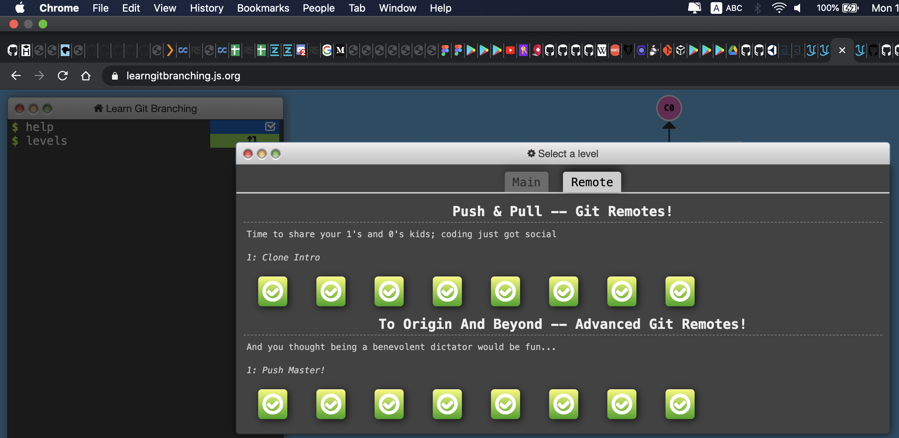

# kottans-frontend

# Front-End Course. Contents

## Stage 0. Self-Study

Preparatory stage of _Front-End Course_. Following tasks should be completed
to join main course. Learn more in [README](README.md).

### General
0. [Git Basics](#0-git-intro)
 
1. [Linux CLI and Networking](#1-linux-cli-http)
 
2. [VCS (hello gitty), GitHub and Collaboration](#2-git-collaboration)

### Front-End Basics
3. [Intro to HTML & CSS](#3-html-css-intro)
 
4. [Responsive Web Design](#4-html-css-responsive)
 
5. [HTML & CSS Practice](#5-html-css-popup)
 
6. [JavaScript Basics](#6-js-basics)
 
7. [Document Object Model](#7-js-dom) - practice

### Advanced Topics
8. [Building a Tiny JS World (pre-OOP)](#8-js-pre-oop) - practice
 
9. [Object oriented JS](#9-js-oop) - practice
 
10. [OOP exercise](#10-js-post-oop) - practice
 
11. [Offline Web Applications](#11-app-design-offline) - optional

12. [Memory pair game](#12-memory-pair-game) — real project!

13. [Website Performance Optimization](#13-app-design-performance) - optional

14. [Friends App](#14-friends-app) - real project!

#### 0 Git intro

* [x] Finish the course [Version Control with Git](https://classroom.udacity.com/courses/ud123)

I've already worked with git locally, so this topic is not someting brand new to me. Though, I liked the way the material is performed in this course, it seems well-structured and covers the very first steps for exploring version control system.



* [x] Complete the following levels at [learngitbranching.js.org](https://learngitbranching.js.org):

I've discovered a ```rebase``` command: it is used when we want to make it look like two features were developed sequentially in one branch, when in reality they were developed in parallel in different branches.



Practicing git remotes while faking a teamwork was all new to me. I've discovered the difference between ```rebase``` and ```merge```(creates new commit), uncovered the inner nature of ```pull``` (which is ```fetch``` combined with ```merge``` ). Also I've learned how to solve conflicts with locked master branch. I will definitely use this knowledge in future!



* [x] Send a [pull-request](https://github.com/kottans/mock-repo/pull/553) to Kottans/mock-repo proposing a change.
This was a really cool experience! Sending a pull request was absolutely new to me and now I feel more confident with git.

#### 1 Linux CLI Http

* [x] [Linux Survival (4 modules)](https://linuxsurvival.com/linux-tutorial-introduction/)

I've been using cli in Linux ( Ubuntu, if being precisely ) for the last 7 years already. Though, I've discovered some new  commands:
Here are the basic Linux print commands:
- ```lpr``` for sending to printer
- ```lpq```  for displaying print queue
- ```lprm``` for removing from print queue

and I was surprised, about the ```finger```, which shows the user's info: name, home catalogue, etc.









* [] [HTTP: The Protocol Every Web Developer Must Know - Part 1](https://code.tutsplus.com/tutorials/http-the-protocol-every-web-developer-must-know-part-1--net-31177)

* [] [HTTP: The Protocol Every Web Developer Must Know - Part 2](https://code.tutsplus.com/tutorials/http-the-protocol-every-web-developer-must-know-part-2--net-31155)

#### 2 Git collaboration

This Udacity course makes a great summary and gives advanced explanations to the practice of pull-request, performed at task 0.
I've got a great advice, which is wonderfully obvious:

> ⚠️ Prefer Working Locally ⚠️
> Because GitHub has a web interface, it allows you to add commits manually through its interface. But just because you can do a thing, **doesn't mean you should**. I've demoed making these changes this way so that we could simulate commits being on the remote repository but not in the local repository. But I recommend that you should always work locally on a project and then push those changes to the remote repository.

In addition I'd like to highlight the importance of ```git fetch```:

>One main point when you want to use ```git fetch``` rather than ```git pull``` is if your remote branch and your local branch both have changes that neither of the other ones has. In this case, you want to fetch the remote changes to get them in your local branch and then perform a merge manually. Then you can push that new merge commit back to the remote.

Forking a remote repository (ref Lesson2) was recently cpompleted by me at task 1, when I was aimed to fork the kottans repo and perform some changes. So, I'm sure, this is what I'll be performing for many times in future.

```git shortlog``` was a command that has surprised me — it's really convenient and makes the collaboration easy-peasy. I'll definittely use it if forking a repo.
Flags available:
> ```-s``` to show just the number of commits (rather than each commit's message)
> ```-n``` to sort them numerically (rather than alphabetically by author name).

> When to ```rebase```
The ```git rebase``` command can help you edit commit messages, reorder commits, combine commits, etc.

>Whenever you rebase commits, Git will create a new SHA for each commit! To Git, the SHA is the identifier for a commit, so a different identifier means it's a different commit, regardless if the content has changed at all.

>So you should not rebase if you have already pushed the commits you want to rebase. If you then use git rebase to change things around and then force push the commits, then the other developers will now be out of sync with the remote repository. They might just have to scrap all of their work and start over with your newly-rebased, force-pushed commits.

* [x] [GitHub & Collaboration](https://classroom.udacity.com/courses/ud456)



Complete the following levels at [learngitbranching.js.org](https://learngitbranching.js.org):

** [x] Main: Ramping Up, Moving Work Around



** [x] Remote: To Origin and Beyond



#### 3 HTML CSS intro

#### 4 HTML CSS responsive

#### 5 HTML CSS popup

#### 6 JS basics

#### 7 JS DOM

#### 8 JS pre-OOP

#### 9 JS OOP

#### 10 JS post-OOP

#### 11 App design offline

#### 12 Memory pair game

#### 13 App design performance

#### 14 Friends app
